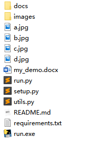

昨晚xml又又又要求弄啥奖状了，还要换背景，改文字。有点麻烦，今天想要能不能自动化控制这个流程，做一个简单化的奖状生成程序

### 输入：
* 程序目录下需要存放若干张 `.png`, `.jpg`, `.bmp`格式的背景图片，数目决定了输出的`.docx`文件的页数

### 输出：
*  `.docx`文件

有了想法，那就马上开始动手操作吧

网上搜罗了[pyhon-docx](https://python-docx.readthedocs.io/en/latest/)的信息以及一些tutorial，感觉操作不是很复杂，可以一步一步来。

### 功能： 
* 自动读取寻找好的背景图片，设置高，宽，一页的数目
* 在背景图片上添加示例文本框， 在`.docx`中可以修改 [当前还不支持]

### 效果图



### 使用方法
#### 安装
使用 `pip` 安装 `python-docx`，这里我直接把环境需要的包放在[requirements](requirements.txt)文件中了，命令行直接安装

```shell
pip install -r requirements.txt
```

#### Python中的使用
首先需要把需要生成排列的图片放置到[run.py](run.py)同级目录下，然后就可以通过以下命令

```shell
python run.py --number 3 --margin 0.5
```
生成每页3张，页边距为0.5cm的word文件

#### Windows可执行文件的使用
另外也提供了`run.exe`文件用于不会python的小伙伴使用这个工具，方法类似与上面，只是现在换成了双击执行`.exe`文件

> 官方文档 https://python-docx.readthedocs.io/en/latest/
